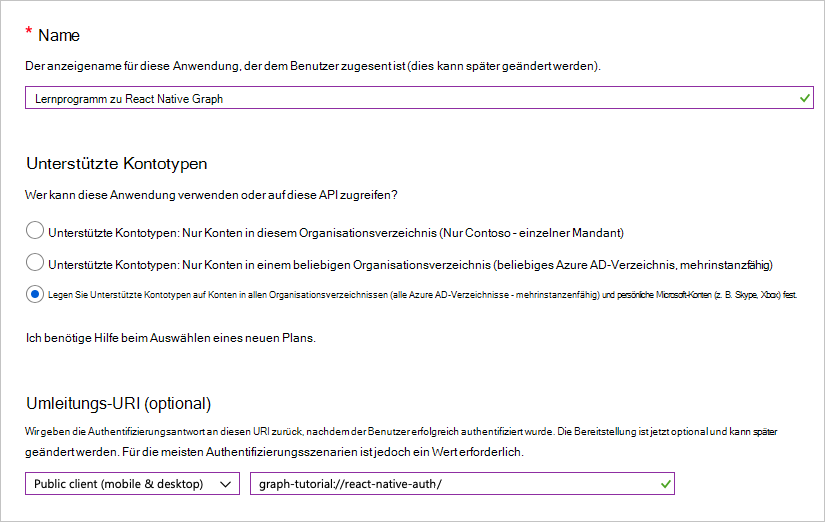

<!-- markdownlint-disable MD002 MD041 -->

In dieser Übung erstellen Sie mithilfe des Azure Active Directory Admin Center eine neue Azure AD systemeigene Anwendung.

1. Öffnen Sie einen Browser, und navigieren Sie zum [Azure Active Directory Admin Center](https://aad.portal.azure.com). Melden Sie sich mit einem **persönlichen Konto** (auch: Microsoft-Konto) oder einem **Geschäfts- oder Schulkonto** an.

1. Wählen Sie in der linken Navigationsleiste **Azure Active Directory** aus, und wählen Sie dann **App-Registrierungen** unter **Manage**aus.

    

1. Wählen Sie **Neue Registrierung** aus. Legen Sie auf der Seite **Anwendung registrieren** die Werte wie folgt fest.

    - Legen Sie **Name** auf `React Native Graph Tutorial` fest.
    - Legen Sie **Unterstützte Kontotypen** auf **Konten in allen Organisationsverzeichnissen und persönliche Microsoft-Konten** fest.
    - Ändern Sie unter **Umleitungs-URI**das Dropdown-Menü auf **Public Client (Mobile #a0 Desktop)**, `graph-tutorial://react-native-auth`und legen Sie den Wert auf fest.

    

1. Wählen Sie **registrieren**aus. Kopieren Sie auf der Seite **systemeigene Graph-Lernprogramm reagieren** den Wert der **Anwendungs-ID (Client)** , und speichern Sie Sie, um Sie im nächsten Schritt zu benötigen.

    

1. Wählen Sie unter **Verwalten**die Option **Authentifizierung**aus. Fügen Sie auf der Seite " **Umleitungs-URIs** " einen weiteren Umleitungs-URI vom Typ " **Public Client" (Mobile #a0 Desktop)** mit dem URI `urn:ietf:wg:oauth:2.0:oob`hinzu. Klicken Sie auf **Speichern**.

    
